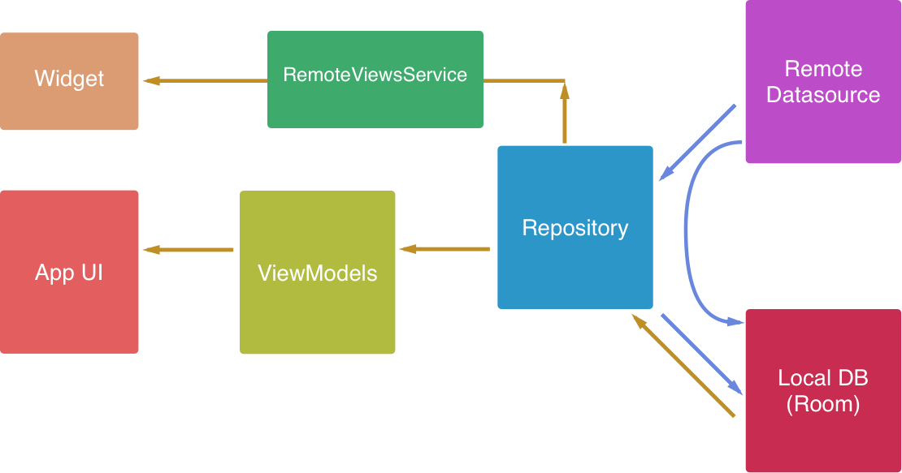
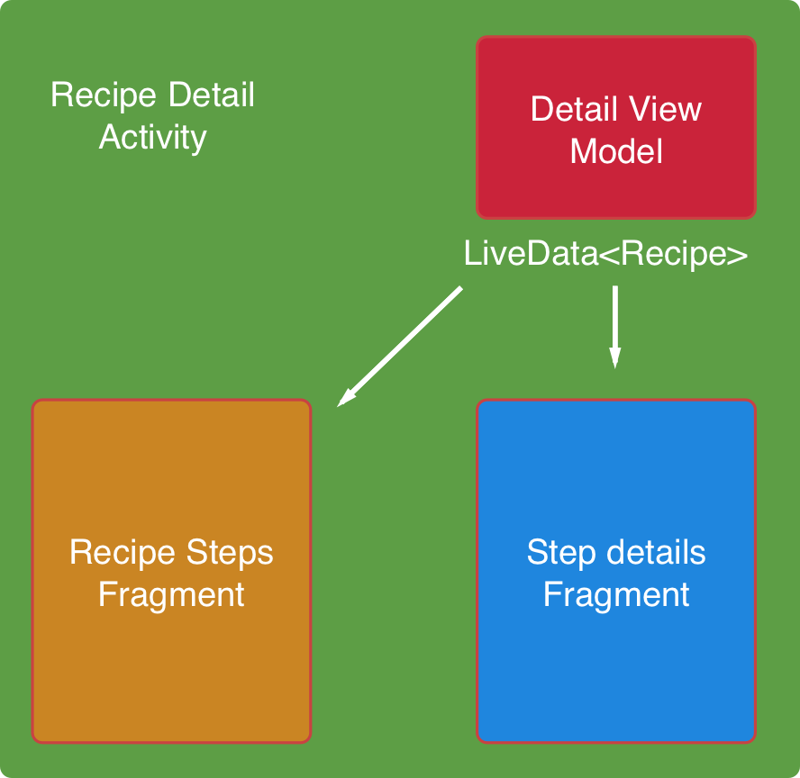

# Desserter

This sample app is prepared for Udacity's Baking app lesson.

You can download the apk file and play around with the app from [releases](https://github.com/drulabs/desserter/releases) tab. 

## Working

The app follows repository pattern and use android architecture components. Libraries used are 
described in section below.

#### App flow:
The app gets data from provided CDN file (can also be API) and stores in local database using 
architecture component's Room ORM. This is done by RecipeRepository. The data exposed from 
RecipeRepository is the data from local DB. Whenever the cache expires, a data is freshly fetched
 from the remote source and local database is updated. This new data is then exposed via 
 architecture component's LiveData. 

Here is a break down of the steps mentioned above:
- App opens, repository fetches data from the remote source (if cache is expired).
- This data is inserted into local database via android architecture component's Room.
- Data from local database is exposed via LiveData to ViewModels.
- Activities observes this View Model and consumes the data (i.e. displays in the UI).

A simple illustration is shown below in diagram.

- The fragments in the details activity communicate via LiveData, only minimal communication is 
done via parent activity as show below.

### 3rd Party Libraries

The following libraries are included:

-   Android Architecture component
    - Room - for local persistence
    - lifecycle
    - java 8 support for lifecycle
    - Live Data
    - View Model
- Picasso - image rendering
- RxJava2 - Reactive programming
- Dagger2 - Dependency injection
- ExoPlayer - for media
- Retrofit2 - for networking
    - Retrofit gson converter
    - Retrofit RxJava adapter

### Issues

If you come across any issues, do raise it in the [issues](https://github.com/drulabs/desserter/issues) tab.
